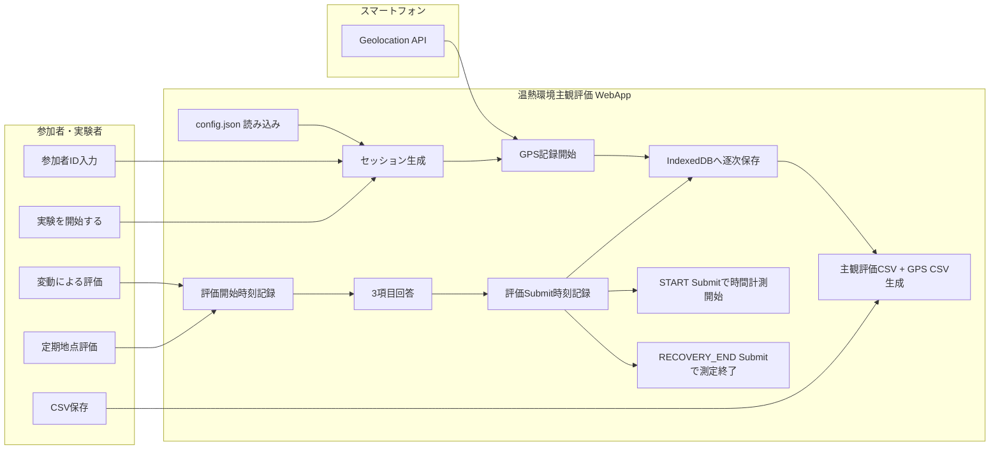

<div id="top"></div>

# 温熱環境主観評価 WebApp

温熱環境主観評価 WebApp は，屋外歩行実験において，参加者の主観的な温熱評価とスマートフォンの位置情報を同時に記録する Web アプリケーションである．

主観評価では，温冷感，温熱的快・不快，温熱選好の3項目を記録する．評価は，「感じ方が変わったとき」に参加者が回答する変動評価と，実験者が指定した地点で回答する定期地点評価の2種類に対応する．

GPS は「実験を開始する」を押した時点から取得を開始し，実験の時間計測は最初の「実験開始」評価を Submit した時点から開始する．最後の定期地点評価を Submit すると測定を終了し，主観評価 CSV と GPS CSV を1つのボタンから連続して保存する．

---

## 使用技術一覧

<p style="display: inline">
  
  
  
  
  
  
  
  
</p>

---

## 目次

- [プロジェクトについて](#プロジェクトについて)
- [ファイル構成](#ファイル構成)
- [利用するWeb API](#利用するweb-api)
- [主観評価項目](#主観評価項目)
- [評価タイミング](#評価タイミング)
- [定期地点評価](#定期地点評価)
- [GPS記録](#gps記録)
- [測定期間](#測定期間)
- [画面構成](#画面構成)
- [保存データ](#保存データ)
- [時刻形式](#時刻形式)
- [端末内保存](#端末内保存)
- [データフロー](#データフロー)
- [使用方法](#使用方法)
- [注意点](#注意点)

---

## プロジェクトについて

本アプリは，屋外歩行中の温熱環境評価実験において，参加者の主観評価と位置情報を記録するための Web アプリケーションである．

実験開始前に参加者 ID を入力し，実験中は以下の2種類の評価を記録する．

- **変動による評価**
  - 参加者自身が温熱感覚の変化を感じたときに回答する．
- **定期地点評価**
  - 実験開始，P1終了，P2終了，P3終了，ルート終了，回復終了の各時点で回答する．

各評価では，温冷感，温熱的快・不快，温熱選好を同時に回答する．

GPS は「実験を開始する」を押した時点から連続取得する．一方，画面上の実験経過時間は，最初の定期地点評価である「実験開始」を Submit した時点を 0 s とする．

最後の「回復終了」評価を Submit すると実験を終了し，CSV保存ボタンと新しい実験を開始するボタンを表示する．

<p align="right">(<a href="#top">トップへ戻る</a>)</p>

---

## ファイル構成

```text
.
├── index.html
├── style.css
├── app.js
├── config.json
└── README.md
```

各ファイルの役割は以下である．

| ファイル | 内容 |
|---|---|
| `index.html` | 画面構成，評価モーダル，操作ボタンを定義する． |
| `style.css` | 画面レイアウト，ボタン，評価UI，スマートフォン向け表示を定義する． |
| `app.js` | 主観評価，GPS記録，時刻管理，IndexedDB保存，CSV生成を処理する． |
| `config.json` | 定期地点評価の順序，GPS取得条件，GPS精度閾値を管理する． |
| `README.md` | 本アプリの仕様と使用方法を記載する． |

<p align="right">(<a href="#top">トップへ戻る</a>)</p>

---

## 利用するWeb API

本アプリでは外部ライブラリを使用せず，ブラウザ標準の Web API を利用する．

### Geolocation API

スマートフォンの位置情報を連続取得するために使用する．

```javascript
navigator.geolocation.watchPosition(...)
```

GPS取得条件は `config.json` で管理する．

### IndexedDB

主観評価データ，GPSデータ，実験セッション状態をブラウザ内へ逐次保存するために使用する．

CSVを保存する前にページが意図せず再読み込みされた場合でも，保存済みのデータを利用して未終了セッションを復元できる構成とする．

### Screen Wake Lock API

対応ブラウザでは，実験中の画面スリープを抑制するために使用する．

CSV生成には外部ライブラリを使用せず，JavaScript の `Blob` と `download` 属性を用いる．

<p align="right">(<a href="#top">トップへ戻る</a>)</p>

---

## 主観評価項目

主観評価では以下の3項目を記録する．

### 1．温冷感

7段階で回答する．

| 値 | 表示 |
|---:|---|
| -3 | 寒い |
| -2 | 涼しい |
| -1 | やや涼しい |
| 0 | どちらでもない |
| +1 | やや暖かい |
| +2 | 暖かい |
| +3 | 暑い |

CSVには数値を `thermal_sensation` として保存する．

### 2．温熱的快・不快

7段階で回答する．

| 値 | 表示 |
|---:|---|
| -3 | 非常に快い |
| -2 | 快い |
| -1 | やや快い |
| 0 | どちらでもない |
| +1 | やや不快 |
| +2 | 不快 |
| +3 | 非常に不快 |

CSVには数値を `thermal_comfort` として保存する．

### 3．温熱選好

3段階で回答する．

| 表示 | 保存値 |
|---|---|
| もっと涼しく | `cooler` |
| このままでよい | `no_change` |
| もっと暖かく | `warmer` |

CSVには `thermal_preference` として保存する．

最初の評価では各項目を未選択状態で表示し，3項目すべてを回答するまで「完了して保存」ボタンを有効化しない．2回目以降の評価では，直前の回答値を初期値として表示する．

評価値を示すスライダー，回答値テキスト，温熱選好の選択状態には中立的なグレー系の配色を使用し，色によって回答方向を誘導しない構成とする．

<p align="right">(<a href="#top">トップへ戻る</a>)</p>

---

## 評価タイミング

実験中には，「変動による評価」と「定期地点評価」の2種類を使用する．

### 変動による評価

参加者が温熱感覚の変化を感じたときに回答する．

保存時には以下を記録する．

```text
trigger_type = self_change
```

`segment_id` には，評価時点で歩行している現在区間を保存する．

### 定期地点評価

実験者が指定した地点で回答する．

保存時には以下を記録する．

```text
trigger_type = checkpoint
```

定期地点評価は `config.json` で定義した順序で進行する．

評価時は安全な位置で停止して回答し，回答完了後に歩行を再開する運用を想定する．

<p align="right">(<a href="#top">トップへ戻る</a>)</p>

---

## 定期地点評価

既定の定期地点評価は以下の6項目である．

| 順序 | ボタン表示 | `segment_id` | 回答後の現在区間 |
|---:|---|---|---|
| 1 | 実験開始 | `START` | `P1` |
| 2 | P1終了 | `P1_END` | `P2` |
| 3 | P2終了 | `P2_END` | `P3` |
| 4 | P3終了 | `P3_END` | `RETURN` |
| 5 | ルート終了 | `ROUTE_END` | `RECOVERY` |
| 6 | 回復終了 | `RECOVERY_END` | `COMPLETE` |

順序は `config.json` の `checkpointSequence` で変更できる．

```json
{
  "checkpointSequence": [
    {
      "label": "実験開始",
      "segmentId": "START",
      "nextSegment": "P1"
    }
  ]
}
```

定期地点評価は，回答を正常に保存した場合のみ次の項目へ進む．評価モーダルをキャンセルした場合は進行状態を変更しない．

<p align="right">(<a href="#top">トップへ戻る</a>)</p>

---

## GPS記録

GPSは，「実験を開始する」ボタンを押してセッションを作成した時点から取得を開始する．

これにより，最初の「実験開始」主観評価を開始する前から位置情報を確保し，最初の主観評価とGPSの時刻対応を安定させる．

位置情報は `navigator.geolocation.watchPosition()` を使用して取得する．GPSの取得頻度はブラウザおよび端末側で決定されるため，厳密な 1 Hz は保証しない．

`config.json` の既定値は以下である．

```json
{
  "gpsOptions": {
    "enableHighAccuracy": true,
    "maximumAge": 1000,
    "timeout": 15000
  },
  "gpsAccuracyThresholds": {
    "good": 20,
    "warning": 50
  }
}
```

GPS精度 `accuracy` に応じて，画面上に以下の状態を表示する．

| 条件 | 表示例 |
|---|---|
| 20 m以下 | 良好 |
| 20 m超，50 m以下 | 注意 |
| 50 m超 | 精度低下 |

GPS記録は最後の定期地点評価を Submit した時点で終了する．

<p align="right">(<a href="#top">トップへ戻る</a>)</p>

---

## 測定期間

本アプリでは，GPS記録開始時刻と実験時間計測開始時刻を分けて扱う．

```text
「実験を開始する」
        ↓
GPS記録開始
        ↓
「定期地点評価：実験開始」を開く
        ↓
実験開始評価をSubmit
        ↓
実験経過時間の計測開始
        ↓
各区間・各主観評価
        ↓
「定期地点評価：回復終了」をSubmit
        ↓
実験経過時間・GPS記録終了
```

実験経過時間は，以下の期間として扱う．

```text
開始：START評価の evaluation_submitted_at
終了：RECOVERY_END評価の evaluation_submitted_at
```

一方，後処理でGPSやWeatherデータをマッピングする場合は，主観評価が存在する有効範囲として，以下を使用できる．

```text
最初の主観評価の evaluation_started_at
～
最後の主観評価の evaluation_submitted_at
```

この範囲は主観評価CSVから決定できるため，CSVへ追加の開始・終了列は保存しない．

<p align="right">(<a href="#top">トップへ戻る</a>)</p>

---

## 画面構成

### 実験開始画面

以下を表示する．

- 参加者ID入力欄
- 実験開始ボタン

参加者IDには，時計回り・逆回りなどの実験条件を含めることができる．

例：

```text
A_CW
A_CCW
```

参加者IDはCSV内部の列には保存せず，ファイル名へ使用する．

### 実験画面

画面上部には以下を表示する．

- 参加者ID
- 経過時間
- GPS状態
- 現在区間
- 主観評価記録件数
- GPS記録件数

評価ボタンとして以下を配置する．

- 変動による評価
- 定期地点評価

最初の「実験開始」評価が完了するまでは，「変動による評価」を使用しない．

### 評価モーダル

以下の3項目を1画面で回答する．

- 温冷感
- 温熱的快・不快
- 温熱選好

評価画面を開いた時刻を `evaluation_started_at`，回答を保存した時刻を `evaluation_submitted_at` として記録する．

### 実験終了画面

最後の定期地点評価を保存すると，以下を表示する．

- 測定時間
- 主観評価件数
- GPS件数
- CSVを保存する（2ファイル）
- 新しい実験を開始する

<p align="right">(<a href="#top">トップへ戻る</a>)</p>

---

## 保存データ

最後の定期地点評価を保存した後，「CSVを保存する（2ファイル）」を押すと，以下の2ファイルを連続ダウンロードする．

```text
{sessionId}_subjective.csv
{sessionId}_gps.csv
```

`sessionId` は以下の形式で生成する．

```text
参加者ID_YYYYMMDDTHHMMSS
```

例：

```text
A_CW_20260802T153628_subjective.csv
A_CW_20260802T153628_gps.csv
```

### 主観評価CSV

| 列名 | 内容 |
|---|---|
| `trigger_type` | `checkpoint` または `self_change` |
| `segment_id` | 評価時点の区間または定期地点ID |
| `evaluation_started_at` | 評価画面を開いた時刻 |
| `evaluation_submitted_at` | 評価を保存した時刻 |
| `response_duration_ms` | 評価開始から保存までの時間 [ms] |
| `thermal_sensation` | 温冷感 [-3〜+3] |
| `thermal_comfort` | 温熱的快・不快 [-3〜+3] |
| `thermal_preference` | `cooler`，`no_change`，`warmer` |

### GPS CSV

| 列名 | 内容 |
|---|---|
| `timestamp` | GPS取得時刻 |
| `latitude` | 緯度 [degree] |
| `longitude` | 経度 [degree] |
| `accuracy` | 水平位置精度 [m] |
| `heading` | 進行方向 [degree] |
| `speed` | 移動速度 [m/s] |

標高 `altitude` および標高精度 `altitude_accuracy` は保存しない．

CSVは UTF-8 BOM 付きで生成する．

<p align="right">(<a href="#top">トップへ戻る</a>)</p>

---

## 時刻形式

主観評価CSVおよびGPS CSVの時刻は，ローカル時刻をミリ秒まで含めて以下の形式で保存する．

```text
YYYY/MM/DD hh:mm:ss.mmm
```

例：

```text
2026/08/02 15:36:28.844
```

JavaScriptでは以下の関数を使用する．

```javascript
function formatLocalTimeWithMs(epochMs) {
  const d = new Date(epochMs);
  const pad = (n, w=2) => String(n).padStart(w, "0");
  return `${d.getFullYear()}/${pad(d.getMonth()+1)}/${pad(d.getDate())} `
       + `${pad(d.getHours())}:${pad(d.getMinutes())}:${pad(d.getSeconds())}.${pad(d.getMilliseconds(),3)}`;
}
```

<p align="right">(<a href="#top">トップへ戻る</a>)</p>

---

## 端末内保存

主観評価，GPS，セッション状態は IndexedDB へ逐次保存する．

使用するストアは以下である．

| ストア | 内容 |
|---|---|
| `sessions` | 参加者ID，現在区間，定期地点評価の進行状態など |
| `subjective` | 主観評価レコード |
| `gps` | GPSレコード |

未終了セッションのIDは `localStorage` に保持する．ページを再読み込みした場合，未終了セッションが存在すると再開確認を表示する．

CSVは実験終了時に IndexedDB 内のレコードから生成する．

<p align="right">(<a href="#top">トップへ戻る</a>)</p>

---

## データフロー



<p align="right">(<a href="#top">トップへ戻る</a>)</p>

---

## 使用方法

### 1．WebAppを開く

Netlify などの HTTPS 環境へデプロイした WebApp をスマートフォンのブラウザで開く．

位置情報取得には HTTPS 環境が必要である．ローカルで確認する場合は `localhost` を使用する．

例：

```bash
python -m http.server 8000
```

ブラウザで以下にアクセスする．

```text
http://localhost:8000
```

### 2．参加者IDを入力する

参加者IDを入力する．

例：

```text
A_CW
```

入力後，「実験を開始する」を押す．

### 3．位置情報を許可する

ブラウザから位置情報の使用許可を求められた場合は許可する．

「実験を開始する」を押した後からGPS記録を開始する．

### 4．実験開始時の主観評価を回答する

「定期地点評価：実験開始」を押し，以下の3項目を回答する．

- 温冷感
- 温熱的快・不快
- 温熱選好

「完了して保存」を押すと，この Submit 時刻を基準に実験経過時間の計測を開始する．

### 5．歩行中に主観評価を記録する

温熱感覚が変化した場合は，「変動による評価」を使用する．

定期地点に到達した場合は，「定期地点評価」を使用する．ボタン表示は定期地点評価を保存するたびに自動で次の項目へ進む．

### 6．実験を終了する

最後の「定期地点評価：回復終了」を回答して保存する．

この時点で，実験経過時間とGPS記録を終了する．

### 7．CSVを保存する

実験終了画面の「CSVを保存する（2ファイル）」を押す．

以下の2ファイルを連続ダウンロードする．

```text
*_subjective.csv
*_gps.csv
```

ブラウザから複数ファイルのダウンロード許可を求められた場合は許可する．

### 8．次の実験を開始する

「新しい実験を開始する」を押すと，参加者ID入力画面へ戻る．

<p align="right">(<a href="#top">トップへ戻る</a>)</p>

---

## 注意点

* Geolocation API を使用するため，HTTPS環境または `localhost` で開く必要がある．
* Netlify の `https://xxxxx.netlify.app/` 形式で公開した場合は HTTPS 条件を満たす．
* スマートフォン本体およびブラウザで位置情報の使用を許可する必要がある．
* 一度位置情報を拒否した場合，ブラウザのサイト設定から手動で許可へ変更する必要がある場合がある．
* LINE などのアプリ内ブラウザではなく，Chrome または Safari などの通常ブラウザで開くことを推奨する．
* GPS取得頻度はブラウザ・端末・受信環境に依存し，厳密な 1 Hz は保証しない．
* 建物内や建物付近では，GPSの取得間隔が空いたり，`accuracy` が低下したりする場合がある．
* 主観評価時は安全な位置で停止して回答し，回答完了後に歩行を再開する．
* 最初の評価では回答値を未選択とし，3項目すべてを選択するまで保存できない．
* 2回目以降は直前の回答値を初期値として表示する．
* 参加者IDはCSV内部には保存せず，ファイル名へ含める．
* 「CSVを保存する（2ファイル）」では2つのCSVを連続ダウンロードするため，ブラウザによっては複数ファイルのダウンロード許可を求められる場合がある．
* CSVを保存する前でもデータは IndexedDB へ逐次保存するが，実験終了後は必ずCSVファイルを保存して確認する．
* `config.json` を変更した場合は，ページを再読み込みする．
* 主観評価とGPSを対応付ける場合は，`evaluation_started_at` または `evaluation_submitted_at` とGPSの `timestamp` を時刻基準として使用する．
* GPSやWeatherを後処理でマッピングする場合は，必要に応じて最初の `evaluation_started_at` から最後の `evaluation_submitted_at` までを対象期間として抽出する．

<p align="right">(<a href="#top">トップへ戻る</a>)</p>
